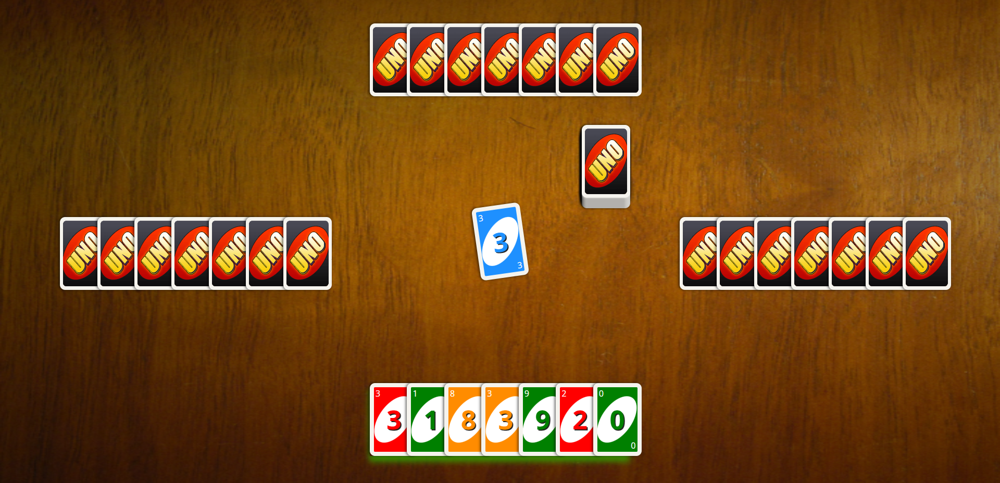

# UNO OYUNU

Bu projede JavaScript kullanarak basit bir UNO kart oyunu geliştirdim. Oyun, HTML, CSS ve JavaScript teknolojilerini kullanarak tarayıcınızda oynanabilir. Oyunun amacı, elinizdeki kartları bitirmek ve diğer oyuncuları alt etmektir.

## Nasıl Oynanır?

1. Oyun başladığında her oyuncu 7 kart alır.
2. Masada bir kart açılır ve bu kartın rengi veya değeri üzerine oynanabilecek kartlar belirlenir.
3. Sıra sizde olduğunda, rengi veya numarası aynı olan kartı masada açık olan kartın üstüne koyabilirsiniz.
4. Eğer elinizde oynayabileceğiniz bir kart yoksa, kart çekmek için ortada bulunan desteden sadece 1 adet kart alabilirsiniz.
5. Eğer çektiğiniz kart ortada bulunan kart ile eşleşmiyorsa sıra otomatik olarak diğer oyuncuya geçer.
6. Oyunculardan biri elinde kart kalmadan oyunu bitirirse, o oyuncu kazanır.

## Kartlar

- Yeşil (Green), Kırmızı (Red), Turuncu (Dark Orange) ve Mavi (Dodger Blue) renklerinde kartlar vardır.
- Kartlar 0'dan 9'a kadar numaralar içerir.

## Kurulum ve Başlatma

1. Projeyi bilgisayarınıza klonlayın veya ZIP olarak indirin.
2. "index.html" dosyasını tarayıcınızda açarak oyunu başlatın.
3. UNO oyununun keyfini çıkarın!